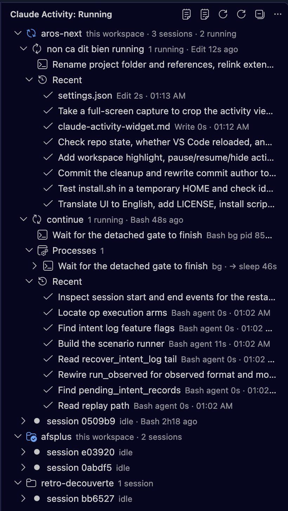

# agent-activity-monitor

See what Claude Code (and Codex) are actually running, right now, from VS Code.
Nothing depends on the agent cooperating: the data comes from hooks the harness
fires on its own, and from the process table.




## What you get

- **Sessions grouped by project**, each titled with the last prompt you sent it.
- **Running calls**: shell commands, sub-agents, workflows, with elapsed time.
- **Background commands** stay listed until their process actually exits, and
  the process tree shows them under the agent's own description instead of the
  raw shell wrapper.
- **Process tree** of every `claude` / `codex` process: what really runs under it
  (`cargo test`, `python`, `sleep`, …), compacted without paths, with a hint of
  the deepest program running.
- **Recent calls** per session, with duration, failures in red, `bg` and `agent`
  tags.
- **Status bar**: `Claude: 2 cmd · 1 agent · 3 proc` or `Claude: idle`.
- Process actions: pause (SIGSTOP), resume (SIGCONT), kill (SIGTERM), copy the
  command. Sessions can be hidden from the view.

## How it works

1. `hooks/log-event.sh` is registered in `~/.claude/settings.json` (and
   `~/.codex/hooks.json`, same protocol) for PreToolUse, PostToolUse,
   PostToolUseFailure, PermissionDenied, SubagentStart/Stop, SessionStart/End, UserPromptSubmit
   and Stop. Each event appends one JSON line to
   `~/.claude/activity/events.jsonl`. Hooks run async, so the agent is not
   slowed down.
2. The extension tails that file and scans `ps` every two seconds for
   descendants of every agent process. Background calls are matched to their
   process by command text.
3. A text mirror of the view is written to `~/.claude/activity/tree.txt`, so an
   agent (or `tail -f`) can read what you see.

Plain JavaScript, no dependencies, no build step.

## Install

Not on the Marketplace yet: the extension ships as a VSIX on the
[GitHub releases](https://github.com/jonx/agent-activity-monitor/releases) page.

1. Clone the repo and register the hooks (requires `jq`):

   ```sh
   git clone https://github.com/jonx/agent-activity-monitor ~/agent-activity-monitor
   ~/agent-activity-monitor/install.sh --hooks-only
   ```

2. Install the extension: download the `.vsix` from the latest release, then
   `Extensions: Install from VSIX...` in VS Code, or
   `code --install-extension agent-activity-monitor-0.1.0.vsix`.

The view appears in the activity bar after a reload.

`install.sh` merges the hooks into your existing settings (backups are written
next to them). Without `--hooks-only` it also symlinks the extension into
`~/.vscode/extensions`, which is handy while hacking on it. To build the VSIX
yourself:

```sh
cd extension && npx @vscode/vsce package --no-dependencies -o ../agent-activity-monitor.vsix
code --install-extension ../agent-activity-monitor.vsix
```

Do not combine the symlink and the VSIX: remove the symlink first.

Codex (0.154+) asks you to trust the hooks the first time; until then only Codex
processes are visible, not its tool calls.

## Command line

```sh
node ~/agent-activity-monitor/extension/extension.js --dump     # print the tree as text
tail -f ~/.claude/activity/events.jsonl | jq -r '"\(.ts) \(.event) \(.tool // "") \(.summary)"'
```

## Settings

| Setting | Default | Meaning |
|---|---|---|
| `agentActivity.pollIntervalMs` | 2000 | process scan interval |
| `agentActivity.recentCount` | 8 | finished calls kept per session |
| `agentActivity.staleMinutes` | 15 | hide sessions with no live process after this |
| `agentActivity.logPath` | `~/.claude/activity/events.jsonl` | event log location |

## Limits

- Sub-agents are API calls, not processes: they only show up through hooks.
- Cloud jobs (scheduled routines, cloud reviews) leave no local trace.
- The log stores the first 240 characters of each prompt and 600 of each shell
  command. It rotates above 5 MB (`CLAUDE_ACTIVITY_MAX_BYTES` in the hook's
  environment changes that); one previous file, `events.jsonl.1`, is kept.
  Clear it with *Claude Activity: Clear event log* if it should not stick
  around.

## License

MIT
